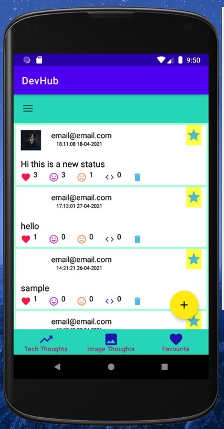
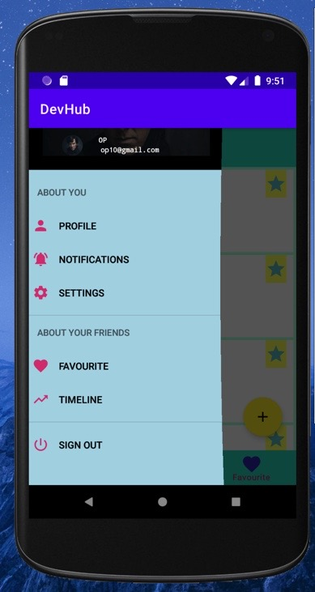
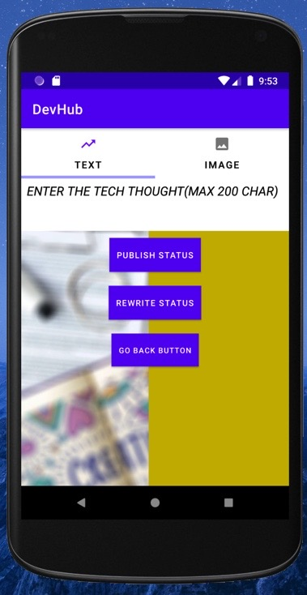
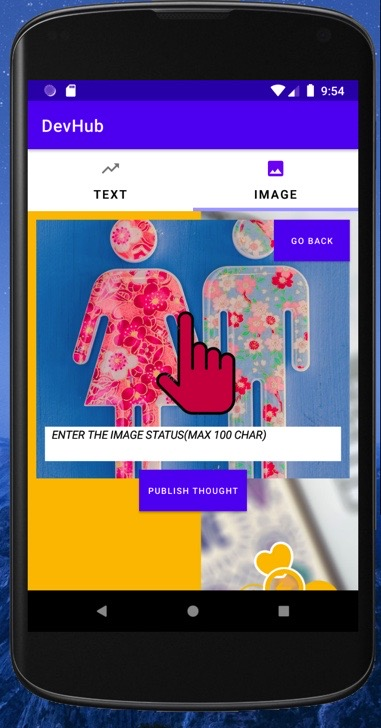

# DEVHUB - CONNECTING DEVELOPERS

#### “ALONE,WE CAN DO LITTLE ; TOGETHER WE CAN DO SO MUCH” - HELEN KELLER

- Our project is based on this quote of Helen Keller where DevHub helps in connecting developers so that they can contribute to the developer community and also engage with other developers.
- Our project DevHub aims to connect developers and help them interact with each other.
A forum like DevHub is a great place for developers to share their expertise and skills.
- Our project will have features like user authentication making it secure to use.
- It also has other features like being able to add tech and images statuses.The developers can express their views toward the statuses with the help of emoticons and also can comment on the statuses.
- The developers can also connect with other developers by being friends with them and they can also favourite statuses of other users.
- Our project has a cloud database – firebase which makes it more convenient to use.There are no advertisements and pop up’s in our app.
### SCREENSHOTS OF OUR PROJECT

#### <a href="https://docs.google.com/presentation/d/1UG00WahYWgcJEY0MaCthcK1tESo52jxhTzcGCdb263E/edit?usp=sharing">HERE IS OUR PRESENTATION </a>
#### <a href="https://onedrive.live.com/view.aspx?resid=BF8DE7FBA292F5A!53137&ithint=file%2cdocx&authkey=!AF3ETYNa-mkzq5w">HERE IS OUR REPORT</a>
